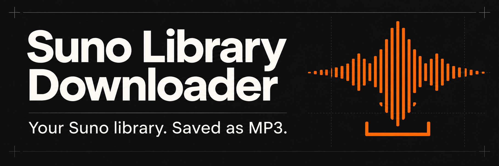
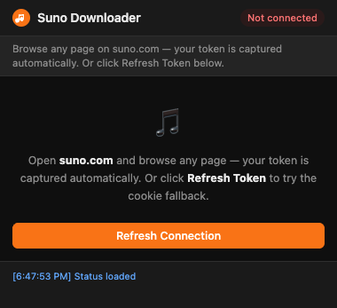

<div align="center">
  

# Suno Library Downloader

Bulk-download songs from your Suno library as MP3 files, with metadata and cover art when available.

[](./background.js) [](./manifest.json) [](#install)

[Install](#install) · [Usage](#usage) · [Privacy & permissions](#privacy--permissions) · [Troubleshooting](#troubleshooting) · [Contributing](./CONTRIBUTING.md)

</div>

A Chrome extension for keeping local copies of music from your own Suno account. Scan your library, choose tracks, and save MP3s to your Downloads folder. Export the scanned library as CSV to keep a searchable record of titles, prompts, tags, and audio URLs.

The extension runs in your browser and uses your existing Suno session. There is no package installation or build step.

## Features

- **Download in bulk or by selection.** Filter songs by title and choose individual tracks.
- **Embed metadata.** Add title, artist, album, genre, year, prompt/lyrics, and cover art to MP3s when available. If the tagged-download path fails, the extension attempts a direct audio download.
- **Keep scan progress.** Save each page locally and offer a resume control for incomplete scans.
- **See download history.** Mark previously downloaded songs in the list; selection remains under your control.
- **Export a library inventory.** Save IDs, titles, durations, models, creation dates, tags, prompts, and audio URLs as CSV.
- **Pace requests.** Scan with a 1.5-second delay between pages, retry rate-limited requests, and process two downloads concurrently.

## Install

```bash
git clone https://github.com/essremodel/suno-downloader.git
```

You need Chrome and a signed-in Suno account. Git is optional: you can also use this repository's **Code → Download ZIP** menu and extract the archive.

1. Open `chrome://extensions` in Chrome.
2. Turn on **Developer mode**.
3. Choose **Load unpacked** and select the folder containing `manifest.json`.
4. Pin **Suno Library Downloader** from Chrome's extensions menu.
5. Open or reload [suno.com](https://suno.com) after loading the extension, then sign in.

This repository provides an unpacked extension. No Chrome Web Store installation is required.

## Usage



*The extension loaded in a fresh browser profile, before connecting to Suno.*

### Connect → scan → save

1. Browse a page on Suno so the extension can capture your session's authentication token.
2. Open the extension. If it says **Not connected**, choose **Refresh Connection**. If needed, reload Suno and reopen the popup.
3. Choose **Scan Library** and wait for the song list.
4. Review the selected count, then choose **Download N MP3s**. To check one file first, **Test Download (1 Song)** downloads the first song in the scanned library.

MP3s are saved under `Suno Downloads/` inside Chrome's configured download directory:

```text
Suno Downloads/
└── Song Title [clipId8].mp3
```

The suffix is the first eight characters of the song ID. Invalid filename characters are replaced, and Chrome gives repeated filenames a unique name.

### Choose exactly what to download

All songs are selected when the library loads, including previously downloaded songs. A checkmark records download history; it does **not** prevent another download.

Searching only changes which rows are visible. It does **not** clear selections outside the filter. To download just the search results, enter a search and choose **All**, which replaces the selection with the visible songs. **None** clears the entire selection.

### Export or continue later

- Choose **Export Library as CSV** to export the entire cached library, regardless of search or selection. The file is named `Suno Library YYYY-MM-DD.csv`.
- An incomplete scan can expose **Resume Scan** or an inline resume link when you reopen the popup. If the resulting library appears incomplete, run **Rescan** from the beginning.
- Change the download location in `chrome://settings/downloads`. There is no separate configuration file or settings panel.

## Privacy & permissions

The extension does not ask you to enter a password. It captures bearer tokens from Suno page requests and **caches the token and expiry in `chrome.storage.local`**, together with the API base, scanned library, scan progress, and download history. These are sensitive local browser data.

The cookie fallback first tries Suno's `__session` cookie, then attempts a Clerk session-token exchange using `__client` on `clerk.suno.com`. Refresh can fail; browsing Suno again may be necessary.

The code contacts Suno's API, Clerk, and audio/artwork URLs to scan and download. It contains no separate analytics or developer-operated upload service. This is a networked tool, not an offline-only application.

| Declared permission | Purpose in this repository |
| --- | --- |
| `cookies` | Read session cookies for the fallback authentication flow |
| `downloads` | Save MP3 and CSV files through Chrome |
| `storage` | Cache authentication, library data, and download history locally |
| `offscreen` | Create blob URLs for MP3s with embedded metadata |
| `scripting`, `activeTab` | Declared in the manifest; not currently used by the implementation |
| Suno page hosts | Run the content scripts on `suno.com` and `www.suno.com` |
| `studio-api.prod.suno.com` | Request the paginated library feed |
| `cdn1.suno.ai`, `cdn2.suno.ai` | Retrieve audio and cover art |
| `clerk.suno.com` | Attempt authentication-token refresh |

See [manifest.json](./manifest.json) for the exact permission list and [background.js](./background.js) for storage and network behavior. Do not include tokens, cookies, HAR captures, or private library exports in public issues.

## Limitations

- **Suno integration can change.** Authentication and the feed endpoint depend on Suno's web behavior. This repository does not guarantee compatibility with future changes.
- **Scan resume is best effort.** The popup resumes after the stored page number. After a failed page, use a full rescan if tracks are missing.
- **Verify saved files.** Download-history markers are a convenience, not an integrity check. The current download wrapper treats a five-minute timeout as completion.
- **Metadata is best effort.** Artwork may be unavailable; a fallback download can lack the metadata added by this extension. Prompt/lyrics tags are truncated to 5,000 characters.
- **Cache follows the browser profile.** Library and download history are not separated by Suno account. Rescan after changing accounts and review the selected tracks.

Use this tool for content you own or have permission to download. It is an independent project, not an official Suno product.

## Troubleshooting

| Symptom | What to try |
| --- | --- |
| **Not connected** | Reload Suno while signed in, browse a page, then reopen the popup or use **Refresh Connection**. |
| **Scan pauses or fails** | Wait for any retry countdown. Refresh your session, reopen the popup, and resume if offered. Use **Rescan** if the inventory looks incomplete. |
| **MP3 fails or artwork is missing** | Try **Test Download (1 Song)** and inspect the service-worker log for the HTTP or download error. Check whether the track still plays on Suno. |
| **Files are in an unexpected folder** | Check `chrome://settings/downloads` and Chrome's download history. |
| **Old extension behavior after an update** | Click the extension's reload button in `chrome://extensions`, then reload your Suno tab. |

For diagnostics, open `chrome://extensions`, find the extension, and inspect its **service worker**. Background messages use the `[BG]` prefix. Right-click the popup and choose **Inspect** for popup errors. Review logs for private information before sharing.

## Development

The JavaScript, HTML, and CSS run directly as an unpacked extension. There is no dependency manifest, automated test suite, CI workflow, or build pipeline in this repository.

| File | Responsibility |
| --- | --- |
| [manifest.json](./manifest.json) | Extension metadata, permissions, and entry points |
| [background.js](./background.js) | Authentication, scanning, download queue, and file saving |
| [injected.js](./injected.js) / [content.js](./content.js) | Capture page request tokens and relay them to the worker |
| [id3-writer.js](./id3-writer.js) | Build MP3 metadata tags |
| [offscreen.html](./offscreen.html) / [offscreen.js](./offscreen.js) | Create and revoke blob URLs |
| [popup.html](./popup.html) / [popup.js](./popup.js) / [popup.css](./popup.css) | Popup interface, controls, and styling |

See [CONTRIBUTING.md](./CONTRIBUTING.md) for local checks and a manual verification checklist.

## License status

No license file is currently included in this repository. No open-source license is declared.
